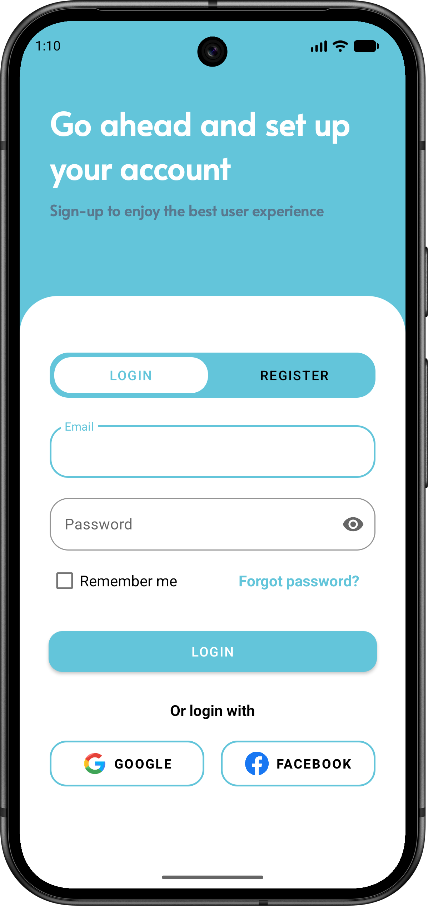
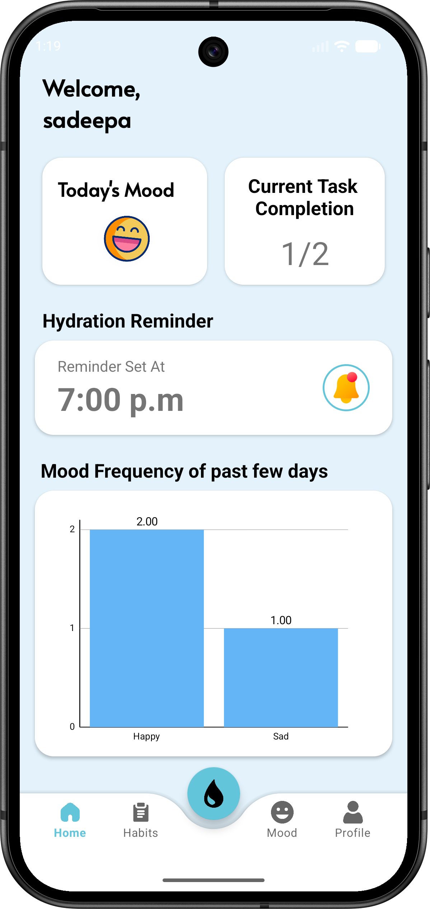
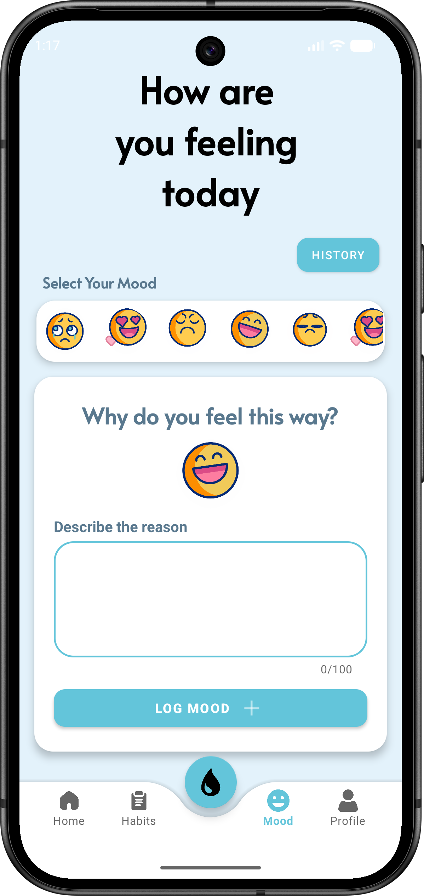
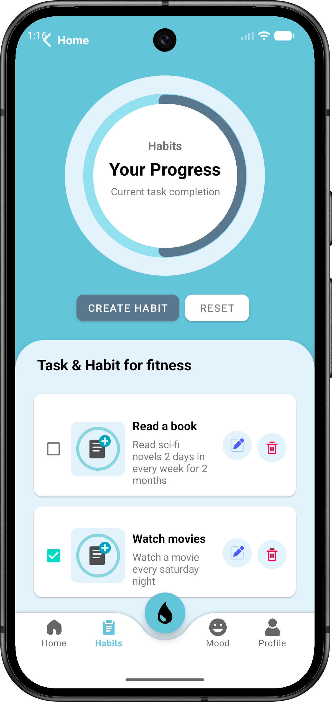
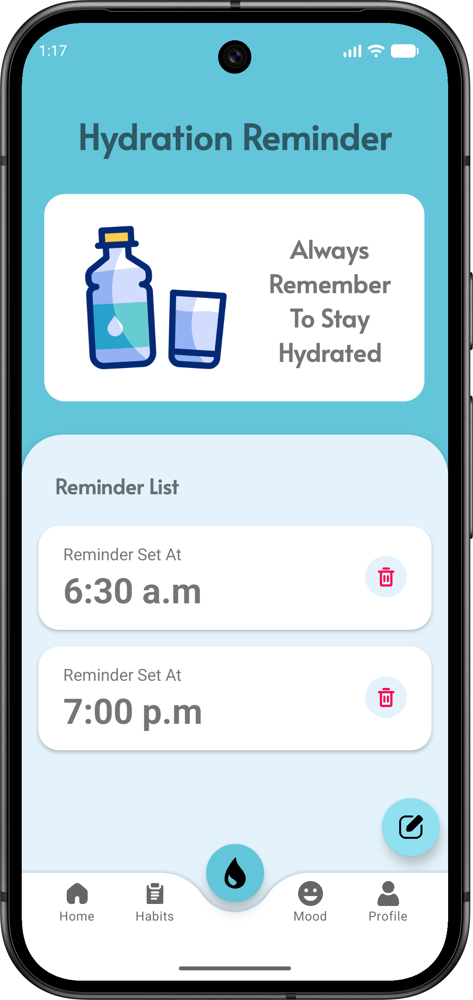
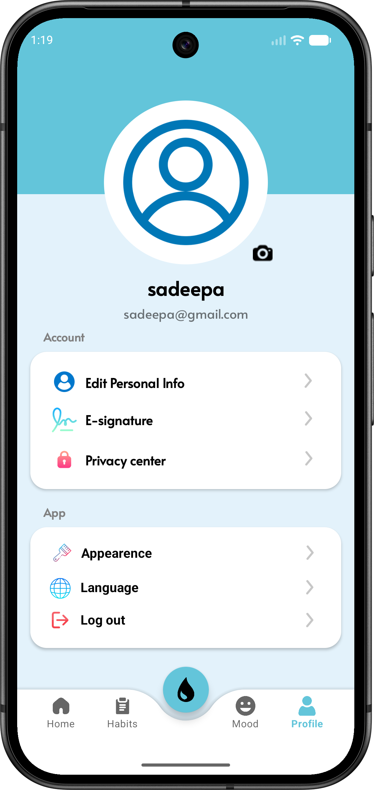

# Lifeline Android App

Lifeline is a personal wellness Android application that helps users track their mood, manage habits, and stay hydrated with reminders. The app features onboarding, user authentication, a dashboard, and persistent data storage using SharedPreferences.

---

## Table of Contents
- [Features](#features)
- [Screenshots](#screenshots)
- [Project Structure](#project-structure)
- [Technologies Used](#technologies-used)
- [Getting Started](#getting-started)
- [Contributing](#contributing)
- [Contact](#contact)
- [License](#license)

---

## Features

- **Onboarding Flow:** Multi-page introduction (Page1–Page5) guides new users through the app’s features.
- **User Registration & Login:** Secure account creation and login with validation. User data is stored locally using SharedPreferences.
- **Home Dashboard:** Displays a personalized greeting and a bar chart of mood statistics for quick insights.
- **Mood Tracking:**
  - Select mood from a horizontal list of emojis/GIFs
  - Add a description and save mood entries
  - View mood history with timestamps and details
- **Habit Management:**
  - Create, edit, delete, and reset habits
  - Track daily habit completion with progress visualization
- **Hydration Reminders:**
  - Schedule daily water intake reminders with custom time
  - View, add, and delete reminders
  - Receive notifications using Android’s AlarmManager and Notification system
- **Profile Management:**
  - View user profile (name, email)
  - Logout and reset onboarding
- **Navigation Bar:** Quickly switch between Home, Habit, Mood, Hydration, and Profile screens

## Screenshots

Below are some screenshots of the Lifeline Android App in action:

| Login Screen | Home Dashboard | Mood Tracking |
|:------------:|:-------------:|:-------------:|
|  |  |  |

| Habit Management | Hydration Reminders | Profile |
|:----------------:|:------------------:|:-------:|
|  |  |  |

<!-- Add your actual screenshot files to the screenshots/ folder with the above names -->

## Project Structure

- `app/` - Main Android application module
  - `src/main/java/com/example/lifeline/`
    - **Activities & Fragments:**
      - `Page1.kt`–`Page5.kt`: Onboarding screens
      - `Register.kt`, `Login.kt`: User authentication
      - `Home.kt`: Dashboard with mood stats
      - `Habit.kt`: Habit management
      - `Mood.kt`, `MoodHistory.kt`: Mood tracking and history
      - `Hydration.kt`: Hydration reminders
      - `Profile.kt`: User profile
      - `NavBar.kt`: Bottom navigation bar
    - **Adapters:**
      - `MoodRecyclerAdapter.kt`, `MoodHistoryAdapter.kt`: Mood lists
      - `ReminderAdapter.kt`: Hydration reminders
      - `ViewPagerAdapter.kt`: Onboarding/login/register pager
    - **Data Models:**
      - `UserDetails.kt`, `MoodItem.kt`, `HabitItem.kt`, `Reminder.kt`
    - **Utilities:**
      - `PrefManager.kt`: Onboarding and preferences
      - `MoodStorage.kt`: Mood data persistence
      - `NotificationUtils.kt`: Notification channel and display
      - `ReminderReceiver.kt`: Broadcast receiver for reminders
      - `MainViewModel.kt`: Splash and onboarding state
  - `src/main/res/layout/` - XML layouts for activities, fragments, and custom dialogs
  - `src/main/res/drawable/` - App icons, mood images, and other graphics
  - `build.gradle.kts` - Module-level Gradle build script
- `build.gradle.kts` - Project-level Gradle build script
- `settings.gradle.kts` - Gradle settings
- `gradle/` - Gradle wrapper and version catalog
- `gradlew`, `gradlew.bat` - Gradle wrapper scripts

## Technologies Used
- Kotlin
- Android SDK (Jetpack, ViewModel, LiveData, etc.)
- Gradle Kotlin DSL
- SharedPreferences
- Material Components
- AlarmManager & Notifications

## Getting Started

### Prerequisites
- [Android Studio](https://developer.android.com/studio) (recommended)
- JDK 17 or later

### Build & Run
1. Clone the repository:
   ```sh
   git clone <repository-url>
   ```
2. Open the project in Android Studio.
3. Let Gradle sync and download dependencies.
4. Build and run the app on an emulator or physical device.

### Command Line
You can also build the project using the Gradle wrapper:
```sh
./gradlew assembleDebug
```

## Contributing

This is a solo project and external contributions are not being accepted at this time.

## Contact

For questions or suggestions, please contact the project owner directly.

## License

This project is licensed under the GNU General Public License v3.0. See the [LICENSE](LICENSE) file for details.
